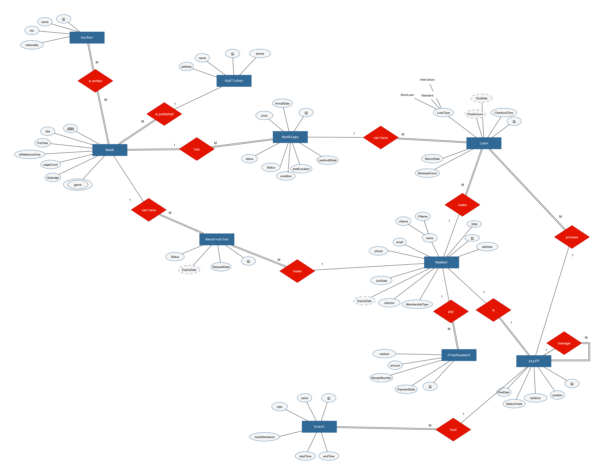
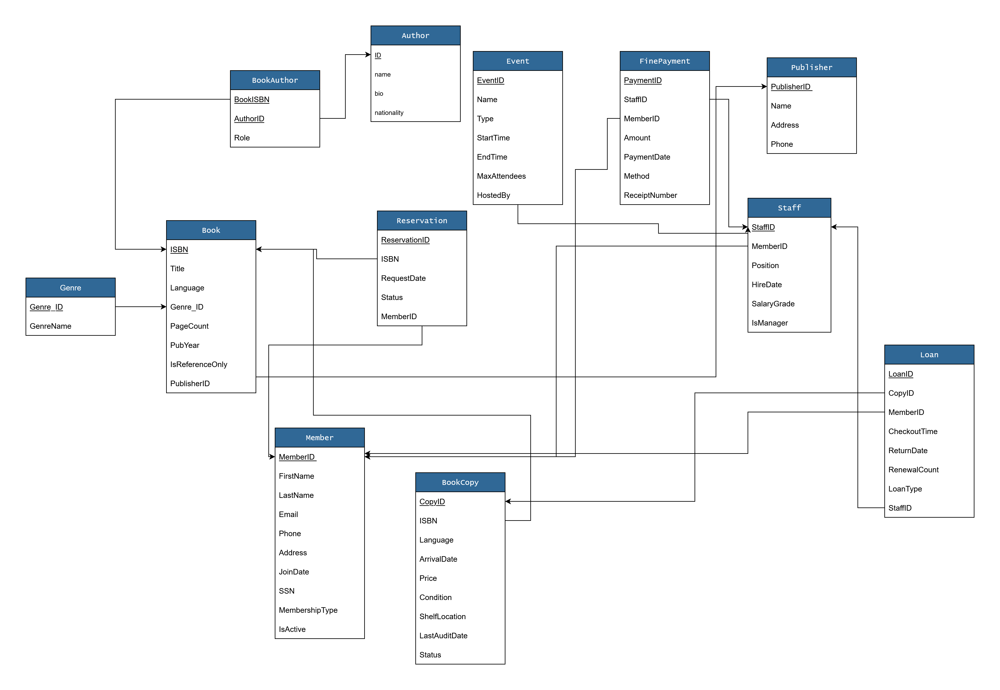

# Library Management System (LMS) Database Project

This repository contains the design and implementation of a Library Management System database using SQL Server. It includes table creation scripts, data population, functions, views, stored procedures, triggers, and sample queries.

## Database Schema

### ERD (Entity-Relationship Diagram)
The following diagram illustrates the physical schema with tables, attributes, and relationships:

- **Tables and Key Fields**:
  - **Genre**: GenreID (PK), GenreName
  - **Author**: ID (PK), name, bio, nationality
  - **BookAuthor**: BookISBN, AuthorID (composite PK?)
  - **Publisher**: PublisherID (PK), Name, Address, Phone
  - **Book**: ISBN (PK), Title, Language, Genre_ID, PageCount, PubYear, IsReferenceOnly, PublisherID
  - **BookCopy**: CopyID (PK), ISBN, Language, ArrivalDate, Price, Condition, ShelfLocation, LastAuditDate, Status
  - **Reservation**: ReservationID (PK), ISBN, RequestDate, ExpireDate, Status, MemberID
  - **Member**: MemberID (PK), FirstName, LastName, Email, Phone, Address, JoinDate, SSN, MembershipType, IsActive
  - **Event**: EventID (PK), Name, Type, StartTime, EndTime, MaxAttendees, HostedBy
  - **FinePayment**: PaymentID (PK), StaffID, MemberID, Amount, PaymentDate, Method, ReceiptNumber
  - **Staff**: StaffID (PK), MemberID, Position, HireDate, SalaryGrade, IsManager
  - **Loan**: LoanID (PK), CopyID, MemberID, CheckoutTime, DueDate, ReturnDate, RenewalCount, LoanType, StaffID

Relationships include foreign keys like Book to Genre, BookCopy to Book, Loan to BookCopy and Member, etc.

### Conceptual Schema
The conceptual model showing high-level entities and relationships:

- **Entities and Relationships**:
  - Book is central, related to Author (is written, M:M), Publisher (is published, 1:M), Genre (genre), BookCopy (can have, 1:M).
  - Member makes Reservation (1:M), pays FinePayment (1:M), borrows Loan (1:M).
  - Staff hosts Event (1:M), processes Loan (M:1), manages FinePayment.
  - Relationships have cardinalities like 1:1, 1:M, M:M.

## Summary of LMS Database Objects
Below is the transcribed summary from [Summary of LMS Database Objects.pdf](Summary%20of%20LMS%20Database%20Objects.pdf).

### Functions

1. **CalculateFine**
   - Purpose: Calculates fines for overdue loans
   - Input: Due date (@DueDate DATE)
   - Output: Fine amount ($10/day, max $200)
   - Used by: BlockMembersWithOverdueFines procedure & trg_CalculateFine trigger

2. **fn_GetTotalFines**
   - Returns total fines paid by a member
   - Input: MemberID INT
   - Output: Sum of all fine payments (DECIMAL(10,2))

3. **fn_GetAvailableCopies**
   - Returns count of available copies for a book
   - Input: ISBN VARCHAR(13)
   - Output: Number of available copies (INT)

4. **fn_MemberFullName**
   - Concatenates member first and last names
   - Input: MemberID INT
   - Output: Full name (VARCHAR(200))

5. **fn_DaysOverdue**
   - Calculates days overdue based on return date
   - Input: ReturnDate DATE
   - Output: Days overdue (INT)

### Views

1. **vw_MonthlyGenrePopularityByMembership**
   - Shows loan counts by genre and membership type (last month)
   - Columns:
     - MembershipType
     - GenreName
     - LoanCount
   - Order: By popularity (LoanCount DESC)

2. **vw_ActiveLoansByMember**
   - Displays current active loans with member details
   - Columns:
     - Member name (FirstName, LastName)
     - MembershipType
     - ActiveLoans (count)
     - LoanLimit (based on membership)
   - Filters: Only members with active loans

3. **vw_BooksLostOrDamaged**
   - Lists books marked as lost/damaged with responsible members
   - Columns:
     - Title
     - Status (Lost / Damaged)
     - LastAuditDate
     - Member name (FirstName, LastName)

4. **vw_LoanFinesSummary**
   - Provides fine calculations per loan
   - Columns:
     - CalculatedFine ($10/day, max $200)
     - TotalPaid (sum of payments)
     - RemainingFine (unpaid balance)

### Stored Procedures

1. **ProcessBookCheckout**
   - Purpose: Validates & processes book checkouts
   - Checks:
     - Member eligibility (IsActive, fine limit, loan limits)
     - Book availability (Status = 'Available', isReferenceOnly = 0)
   - Sets:
     - Due date (Premium: 21 days, others: 14 days)
     - Loan type (Premium: Standard, others: ShortLoan)

2. **ProcessBookReturn**
   - Purpose: Handles book returns
   - Actions:
     - Updates Loan.ReturnDate & BookCopy.Status
     - Calculates fines if overdue ($10/day, max $200)
     - Deactivates members with unpaid fines > $100

3. **GenerateMonthlyGenrePopularityReport**
   - Purpose: Generates borrowing trends report
   - Input: Date range (@StartDate, @EndDate)
   - Output: Loan counts by Genre & MembershipType

4. **MarkBookAsLostOrDamaged**
   - Purpose: Manages lost/damaged books
   - Actions:
     - Updates BookCopy.Status (Lost / Damaged)
     - Charges replacement cost as fine
     - Logs action in AuditLog

5. **BlockMembersWithOverdueFines**
   - Purpose: Deactivates members with unpaid fines > $100
   - Called by: trg_CalculateFine trigger

### Triggers

1. **trg_SetDueDate**
   - Runs on: Loan table (INSERT / UPDATE)
   - Sets due dates based on loan type:
     - Standard → 30 days
     - ShortLoan → 7 days
     - InterLibrary → 1 day

2. **AutoSetBookStatusToLost**
   - Runs on: Loan table (UPDATE)
   - Actions:
     - Marks books as Lost if overdue >60 days
     - Creates ReorderRequest for lost books

3. **trg_CalculateFine**
   - Runs on: Loan table (INSERT / UPDATE)
   - Calls: BlockMembersWithOverdueFines
   - Ensures: Members with fines > $100 are deactivated

4. **PreventReferenceBookLoans**
   - Runs on: Loan table (INSERT)
   - Blocks: Loans for isReferenceOnly = 1 books
   - Error: Cannot loan a reference-only book

### Summary of the Library Database Queries

#### Book-Related Queries

1. **Recent Publications**
   - Retrieves all books published after 2010, showing titles and publication years in descending order

2. **Genre Distribution**
   - Counts books by genre and displays them in order from most to least common

3. **Publisher Statistics**
   - Shows how many books each publisher has published, ranked by volume

4. **Inventory Locations**
   - Lists all book copies with their physical shelf locations, conditions, and current statuses

5. **Condition Report**
   - Provides a count of book copies grouped by their physical condition

#### Member-Related Queries

6. **Membership Breakdown**
   - Counts active members by their membership type (Student, Premium, Adult)

7. **Member Loan History**
   - Displays the complete borrowing history for a specific member including book titles and dates

8. **Active Reservations**
   - Shows all current book reservations that haven't been completed yet

#### Staff & Operational Queries

9. **Staff Directory**
   - Lists all staff members with their positions, hire dates, and salary grades

10. **Fine Collection Analysis**
    - Summarizes total fines collected, grouped by payment method (cash, credit, etc.)

11. **Upcoming Events**
    - Displays all future library events with their details and schedules

## Team Members
- **[nadaKhalid13](https://github.com/nadaKhalid13)**
- **[Ahmed Hamdy](https://github.com/Ahmed-Hamdy)** 
- **[alshimaa AboElqasem](https://github.com/alshimaa-AboElqasem)** 

## Setup Instructions
- **Database**: SQL Server.
- **Execution Order**: Run scripts in sequence:
  1. `1___CREATE_TABLES_WITH_DERIVED_ATTRIBUTES.sql` (creates tables)
  2. `2___Data_POP.sql` (populates data)
  3. `5___FUNC.sql` (functions)
  4. `4___views_4.sql` (views)
  5. `_________Final_TriggersAndProceders_8.sql` (procedures and triggers)
  6. `3___select_with_output_11.sql` and `SELECT_TABLES.sql` (queries)

## Backup and Additional Files
- Database backup: `LMS.bak`
- For diagrams, edit with draw.io: `Copy of LMS.drawio.png`, `LMS_Scheme.drawio.png`

License: MIT (feel free to add or modify).
